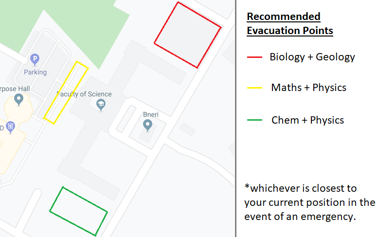
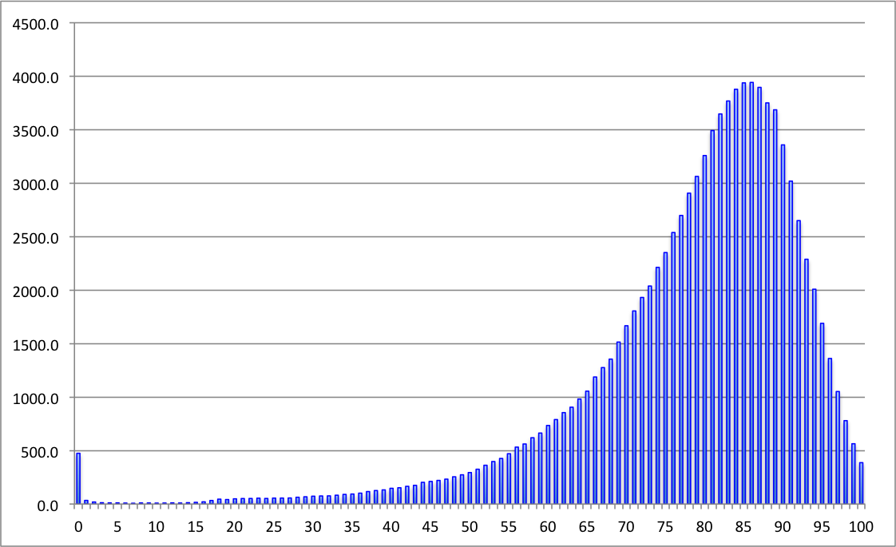
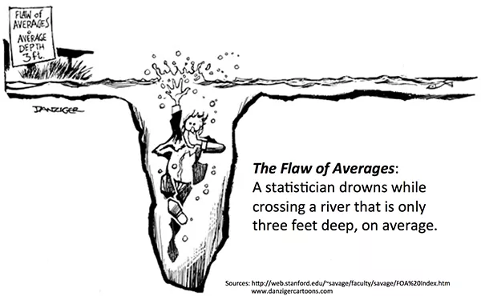
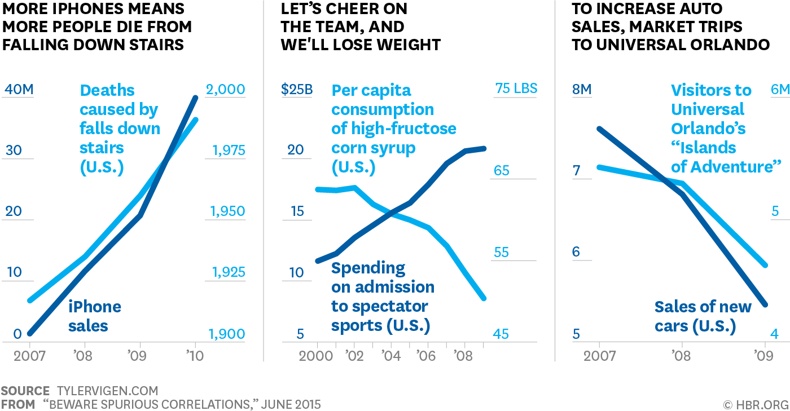
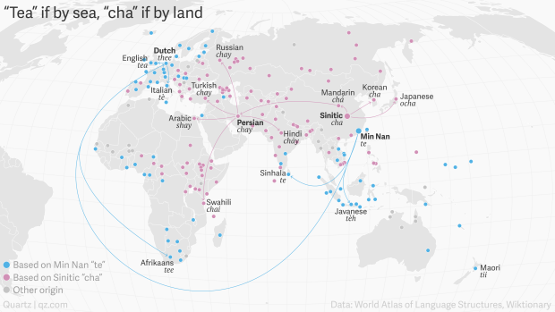
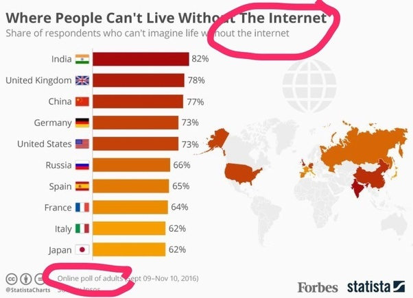
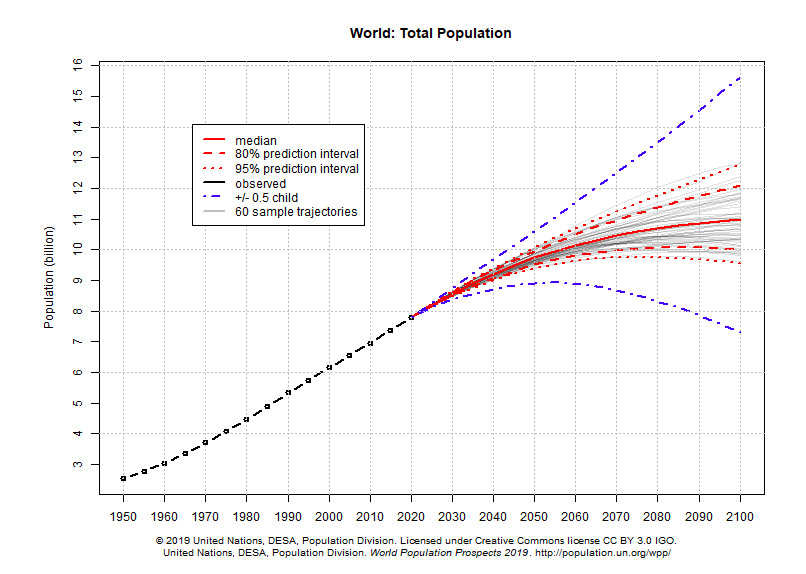

```{r setup, include=FALSE}
options(htmltools.dir.version = FALSE, width = 65)
library(tidyverse)
```

layout:true

# Fire Safety Briefing

---

In the event of a fire, the fire alarm will operate and everyone must immediately evacuate the building. Please:

- Exit the building in a calm and orderly fashion.

- Leave your belongings and non-essential items.

- Do NOT use the lifts; assist anyone having difficulty.

- Make your way to the Assembly Point at BIOLOGY CAR PARK (NEAR BACK ENTRACE TO MASJID)

Please listen to and obey instructions given by Fire Marshalls and Fire & Rescue Personnel. DO NOT ATTEMPT TO RE-ENTER THE BUILDING BEFORE GIVEN THE ALL-CLEAR THAT IT IS SAFE TO DO SO.

---



---
layout:true

# Admin

---

- Lecturer information

  ```html
  Dr. Haziq Jamil
  Assistant Professor in Statistics
  Room M1.09
  haziq.jamil@ubd.edu.bn
  ```

- Classes are on 
   - **Thursdays, 11.50am&mdash;1.40pm** in **FSM 2.19** (Weeks 1-5)
   - **Tuesdays, 9.50am&mdash;11.40am** in **FSM 2.18** (Weeks 8-14)
   - No classes Weeks 6 & 7

- CU-0304 students will only attend the first 7 weeks (Ch. 1-3 only), and then proceed to learn Basic Calculus (Dr. Norhayati Hamzah).

- Slides and materials are available from Canvas.

<!-- - Bring a calculator to class! -->

<!-- - This course is designed for students with no background in stats. -->

---

- The course is assessed as follows:

  - Formative assessment
  
      - Tutorials (no need to hand in)--**attempt questions prior to tutorial
sessions**

--

  - Summative assessment
    
      - 2 × assignments (20% each), due at the end of Mid Sem Break and Week 14--**Note: only one for CU-0304 students**
      
      - Exam (60%) in Early May.

---
layout: true

# Schedule
---

- First half of semester (SM-1402 & CU-0304):

|                 | Day 1    | Day 2    |
|:--------------|----------|----------|
|    Week 1 (start 6/1) | Lecture  |          |
| Week 2 (start 13/1) | Lecture  | Office hours          |
|   Week 3 (start 20/1) | Lecture  | Tutorial |
|  Week 4 (start 27/1) | Lecture  | Office hours         |
|  Week 5 (start 3/2) | Lecture  | Tutorial |
|  Week 6 (start 10/2) |          |          |
| Week 7  (start 17/2) |          |          |
|  Week 8 (start 24/2) | SEMESTER | BREAK    |

- Note: Tutorial days and office hours will be announced later.

---

- Second half of semester (SM-1402 only):

|                  | Day 1          | Day 2        |
|:----------------|----------------|--------------|
|    Week 9 (start 2/3) | Lecture        | Office hours |
|   Week 10 (start 9/3) | Tutorial       |              |
|  Week 11 (start 16/3) | Lecture        | Office hours |
|  Week 12 (start 23/3)| Lecture        |              |
|  Week 13 (start 30/3) | Tutorial       | Office hours |
|  Week 14 (start 6/4)  | Lecture        |              |
|  Week 15 (start 13/4) | Tutorial       | Office hours |
|  Week 16 (start 20/4) | Revision Class |  ⠀⠀⠀⠀⠀⠀⠀⠀           |

- Revision class for both SM-1402 & CU-0304 students.

---
layout: false
# Course contents

- **Chapter 1: Representation and Summary of Data**
  - Discrete & continuous data
  - Frequency distributions & grouping
  - Plots (histograms, frequency polygons, pie charts)
  - Data summaries (mean, median, variance, standard deviation, quartiles)
  - Cumulative frequencies
--

- **Chapter 2: Probability, Arrangements, Permutations, Combinations**
  - Probability notation and laws
  - Venn diagrams and probabilities
  - Conditional probabilities and independent events
  - Probability trees
  - Bayes theorem
  - Arrangements, permutations and combinations
  
---

# Course contents

- **Chapter 3: Discrete Probability Distribution**
  - Probability distribution tables / functions and its features
  - Expectation and variance
  - Cumulative distribution
  - Useful results of expectation and variance
  - Bernoulli and Binomial distribution
  - Poisson distribution
--

- **Chapter 4: Continuous Probability Distribution**
  - Probability density functions and its features
  - Expectation and variance
  - Cumulative density function
  - The normal distribution and its properties
  - Normal approximations
  
---

# Course contents

- **Chapter 5: Sampling and estimation**
  - Sampling and estimation
  - Central limit theorem
  - Point estimates
  - Interval estimates
  


---
class: inverse, middle, center

# Why Statistics?

---
class: middle

.center[.huge[
Statistics is the science of learning from data.
]]

It is the crucial process which allows us to
- make discoveries in scientific studies (_inference_)

- make _predictions_ about future observations

- make informed decisions based on data

.large[.center[Learning Statistics allows you to make _trustworthy analyses and predictions_ about the real world.]]

---
layout: true

# Statistical concerns

---

### 1. Data summary

- A vital part of statistics is to succintly convey and report _information_.

- Being versed in the correct statistical techniques will avoid you being duped by flawed statistics.

- One example: _<u>The flaw of averages</u>_

- While it is useful to condense a large amount of information to a singular 'statistic', often it can be misleading.

---
class:center



Numbers of men expected to die at each age (UK, mortality rate 2010-2012). Mean age = 79, Median = 82, Mode = 86.

---
class:center




---

### 2. What's your proof?

- Statistics provide the framework for discerning 'credible truth' by means of 'statistical significance'.

--

- _Example: A lady declares that by tasting a cup of tea made with milk she can discriminate whether the milk or the tea infusion was first added to the cup._

--

- How do we know she's telling the truth? We can set up an experiment of course...

--

- Eight cups of milk tea were prepared, four of which had the milk poured in first, and the remaining four had the tea poured in first. 

- The lady tastes the tea at random and tells us whether the tea or the milk was poured in first for each cup.

---

### 2. What's your proof?

.center[]

- The lady correctly guesses **3 out of 8**. Is she telling the truth?

--

- The lady correctly guesses **4 out of 8**. Is she telling the truth?

--

- The lady correctly guesses **5 out of 8**. Is she telling the truth?

--

- How large is large?

- We can use a hypothesis test to inform us the chance (p-value) of the lady correctly answering the taste tests, under the assumption that her claim is true.

- Low p-values indicate evidence against her claim.

---

### 3. Measures of association

- Statistics and statistical modelling concerns the measurement of correlations between variables.

- In a lot of scientific studies, we want to understand the behaviour of two or more variables taken together. For example,
  
  - Low unemployment is _associated_ with high GDP output.
  - High satisfaction in the workplace is _associated_ with low turnover (job quitting) rates.
  - Lung cancer is found to be _more prevalent_ among people who smoke.

---

### 3. Measures of association


- Caution: **CORRELATION DOES NOT IMPLY CAUSATION**

--

- "A study found that children with small feet tend to have low IQ scores"

--

- Small feet causes low IQ?

--

- No, children with small feet are younger children, and IQ develops as they grow.
  
---

.center[.large[Be wary of spurious correlations]]



---

On the other hand, causation <u>requires</u> STRONG CORRELATION.

.center[]

---

The world has only two words for tea: tea or cha. Which word you use very much depends on the region you are in (strong correlation). But there is a cause for this:

Chá (茶) is "Sinitic", common to many varieties of Chinese, eventually becoming chai (چای) in Persian.
However, the character is pronounced as 'te', derived probably from tu (荼), in Min Chinese (Fujian etc.).


---

### 4. Reliability (of data and assumptions)

- Understanding _how_ the data was collected, and what (model) _assumptions_ were made, allows us to be vigilant when wrong conclusions are drawn.

--

- _Example: Survey sampling bias._

- Data that is collected should be _representative_ of the population of interest, in order for _valid_ inferences to be drawn.

- Types of sampling errors:
  - Convenience sampling.
  - Substitutions.
  - Multiplicity.
  - Volunteering.

---

.center[]

---

### 5. How likely is it?

- When done correctly, statistical modelling allows us to predict future outcomes (with a degree of confidence).

- This is the main concern of **machine learning**: Learning from data and patterns.

- Statistics also allows us to learn about trends and perform forecasting (time-series analyses).

---

.center[]

---
layout: true

# SM-1402 Basic Statistics

---

- What will we learn in this course?

- Mainly, the foundations and basics of statistics. This includes data summary, probability, and distributions.

- There are several statistics modules being offered here in FOS and they advance progressively.

---
layout: false
class: inverse, middle, center

# END

<!-- ```{r, include = FALSE} -->
<!-- file_name <- paste0("file://", normalizePath("chapter0.html")) -->
<!-- # webshot::webshot(file_name, "chapter0.pdf", delay = 5) -->
<!-- pagedown::chrome_print(file_name) -->
<!-- ``` -->
