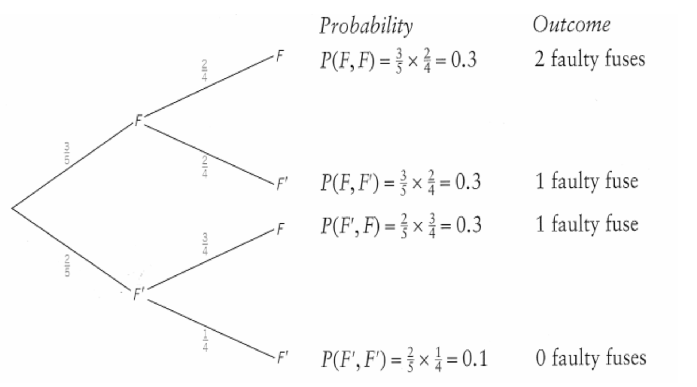
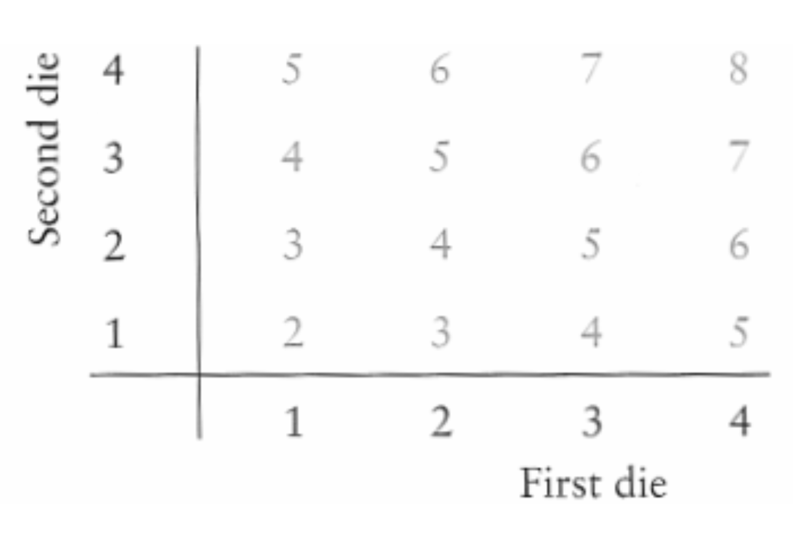
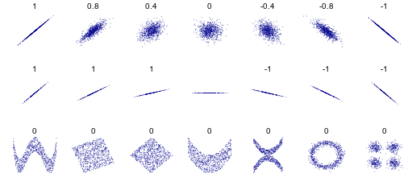
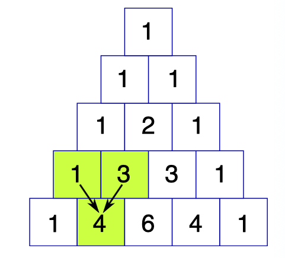
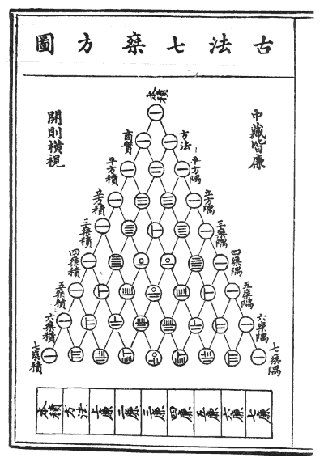
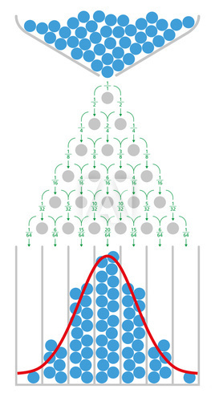

```{r setup, include=FALSE}
options(htmltools.dir.version = FALSE, width = 65)
library(tidyverse)
library(ptree)
```


layout: true

# Probability Distribution

---

- This chapter concerns **discrete random variables**.

- When a variable is discrete, it is possible to specify or describe all possible numerical values, for example
  - _The number for females in a group of four students._ The possible values are 0, 1, 2, 3 and 4.
  - _The number of times you throw a die until a six appears._ The possible values are 1, 2, 3, ... , $\infty$

---

A probability distribution gives the probability of each possible value of the variable. Consider the following situation:

_By mistake, three faulty fuses are put into a box containing two good fuses. The faulty and good fuses become mixed up and are indistinguishable by sight. You take two fuses from the box. What is the probability that you take_

- _(a) no faulty fuses_
- _(b) one faulty fuse_
- _(c) two faulty fuses_

---

.center[]

- (a) P(no faulty fuses) = 0.1
- (b) P(one faulty fuse) = 0.3 + 0.3 = 0.6
- (c) P(two faulty fuses) = 0.3

---

- A _variable_ is an 'object' whose value is subject to change. Let $X$ be the (random) variable which denotes 'the number of faulty fuses'.

- In the example, $X$ can take on three possible values only: 0, 1, 2.

--

- A variable is said to be random if the value it takes cannot be predetermined from available knowledge. Its value is unknown, until it is observed.

--

- (Discrete) Random variables are assigned **probability** to them. For instance,
  - (a) $P(X = 0) = 0.1$
  - (b) $P(X = 1) = 0.6$
  - (c) $P(X = 2) = 0.3$
  
---

- Notation:
  - (Random) variables are denoted by _capital_ letters ( $X$, $Y$, $Z$, etc.)
  - A particular value that the variable takes is denoted by _small_ letters ( $x$, $y$, $z$, etc.)
  - Therefore, $P(X=x)$ means the 'probability that the variable $X$ takes on the value $x$

--
  
- We can summarise the probability distribution for $X$ in a table

| $x$ | 0 | 1 | 2 |
|-----|---|---|---|
| $P(X=x)$ |0.1|0.6|0.3|

- The sum of the probabilities in a probability distribution table must add up to 1.
  
---

- Another way of summarising probability distribution is via a **probability distribution function** (pdf). For example,
$$f(x) = \cases{
0.1 &if \(x=0\) \\
0.6 &if \(x=1\) \\
0.3 &if \(x=2\) \\
}$$
  so $f(x)$ is called the pdf of $X$.  

- The pdf is responsible for allocating probabilities.

--

- Some pdfs lists the probabilities individually (like the one above), but some pdfs summarises the probabilities in a formula.
  $$
  f(x) = 0.1^{\mathbb{1}(x=0)}0.6^{\mathbb{1}(x=1)}0.3^{\mathbb{1}(x=2)}
  $$
  where $\mathbb{1}(\cdot)$ is the indicator function.

---
   
_Example: Two tetrahedral dice, each with faces labelled 1,2,3, and 4, are thrown and the scores noted, where the score is the sum of two nombers on which the dice land. Find the pdf of $X$, where $X$ is defined to be 'the score when two dice are thrown'._

--

The score for each possible outcome is shown in the possibility space:

.center[]

---

We see that possible values for $X$ are 2, 3, 4, 5, 6, 7 and 8.

.center[]

$$
P(X = 2) = \frac{\text{no. of times 2 occurs}}{\text{no. of possible scores}} = \frac{1}{16}
$$

--

Similarly, $P(X=3) = 2/16$, $P(X=4) = 3/16$, etc.  

---

.center[]

The probability distribution is formed:

| $x$ | 2 | 3 | 4 | 5 | 6 | 7 | 8 |
|-----|---|---|---|
| $P(X=x)$ |1/16|2/16|3/16|4/16|3/16|2/16|1/16|

---

Notice the pattern in the probabilities

| $x$ | 2 | 3 | 4 | 5 | 6 | 7 | 8 |
|-----|---|---|---|
| $P(X=x)$ |1/16|2/16|3/16|4/16|3/16|2/16|1/16|

--

We can summarise this in terms of a pdf as

$$P(X=x) = \cases{
\frac{x-1}{16} & \( x=2,3,4,5 \) \\
\frac{9-x}{16} & \( x=6,7,8 \) \\
}$$

And notice that the sum of the probabilities add up to 1.

---
layout: true

# Expectation

---

$E(X)$ is read as 'E of X' and it gives an average or typical value of $X$, known as the _expected value of $X$_, or the _expectation of $X$_.

--

Consider a fair, six-sided die being thrown. The pdf is $P(X=x)=1/6$ for $x=1,2,3,4,5,6$, i.e. the probability is the same regardless of what value $x$ is.

| $x$ | 1| 2 | 3 | 4 | 5 | 6 |
|-----|---|---|---|
| $P(X=x)$ |1/6|1/6|1/6|1/6|1/6|1/6|

---

The expected value of $X$ is obtained by 
- multiplying each score
- by its probability
- and then summing them up.

| $x$ | 1| 2 | 3 | 4 | 5 | 6 |
|-----|---|---|---|
| $P(X=x)$ |1/6|1/6|1/6|1/6|1/6|1/6|

--

$$\begin{align}
E(X) &= 1 \times \frac{1}{6} +  2 \times \frac{1}{6} + 3 \times \frac{1}{6} + 4 \times \frac{1}{6} + 5 \times \frac{1}{6} + 6 \times \frac{1}{6} \\
&= 3.5
\end{align}$$

---

The formula for expectation is given as follows:
$$
E(X) = \sum_{x} x\cdot P(X=x)
$$

The symbol $\mu$ (pronounced 'miu') is often used for the expectation
$$
\mu := E(X)
$$

---
  
_Example: A random variable $X$ has probability distribution as shown. Find the expectation $E(X)$._

| $x$ | -2| -1 |0 | 1 | 2 |
|-----|---|---|---|
| $P(X=x)$ |0.3|0.1|0.15|0.4|0.05|

$$\begin{align}
E(X) &= (-2) \times 0.3 + (-1) \times 0.1 + 0 \times 0.15 \\
&\hspace{3em} + 1 \times 0.4 + 2 \times 0.05 \\
&= -0.2
\end{align}$$

---

The definition of expectation can be extended to any function of $X$.
$$
E\big(g(X)\big) = \sum_{x} g(x)\cdot P(X=x)
$$

--

This allows us to calculate $E(10X)$, $E(X^2)$, $E(1/X)$, $E(X-4)$, etc.

$$\begin{align}
E(10X) &= \sum_{x} 10x \cdot P(X=x) \\
E(X^2) &= \sum_{x} x^2 \cdot P(X=x) \\
E(1/X) &= \sum_{x} \frac{1}{x} \cdot P(X=x) \\
E(X-4) &= \sum_{x} (x-4) \cdot P(X=x) \\
\end{align}$$

---

_Example 3.6: The random variable $X$ has pdf as shown._

| $x$ | 0 | 1 | 2 |
|-----|---|---|---|
| $P(X=x)$ |0.1|0.6|0.3|

_Calculate (a) $E(X)$, (b) $E(3)$, (c) $E(5X)$, (d) $E(5X+3)$_

--

(a) $E(X) = 0 \times 0.1 + 1 \times 0.6 + 2 \times 0.3 = 2.2$

--

(b) $E(3) = 3 \times 0.1 + 3 \times 0.6 + 3 \times 0.3 = 3$

--

(c) $E(5X) = (5\times 0) \times 0.1 + (5 \times 1) \times 0.6 + (5\times 2) \times 0.3 = 11$

--

$$\text{(d)} \begin{align}
E(5X+3) &= (5\times 0 + 3) \times 0.1 + (5 \times 1 + 3) \times 0.6 \\
&\hspace{3em} + (5\times 2 + 3) \times 0.3 \\
&= 14 \\
\end{align}$$

---

- In general, for constants $a$, $b$, $c$, and two random variables $X$ and $Y$
$$\begin{align}
E(aX + bY + c) &= aE(X) + bE(Y) + c
\end{align}$$
  This property is known as the _linearity of expectations_.

--

- For two functions of $X$, $g(X)$ and $h(X)$,
  $$E\big( g(X) + h(X) \big) = E\big( g(X) \big) + E\big( h(X) \big)$$

   This property allows us to easily calculate the variance...

---
layout:true

# Variance

---

Recall that a set of observations $x_1,\dots,x_n$, the (sample) mean and variance is given by

$$\bar x = \frac{1}{n}\sum_{i=1}^n x_i \hspace{1cm} s^2 = \frac{1}{n}\sum_{i=1}^n (x_i - \bar x)^2$$

--

For a random variable $X$, we saw that the mean is $\mu= E(X)$ ("the average value of $X$").

--

In the same spirit as the sample variance for observations, we define the variance of $X$ to be 

$$\text{Var}(X)=E\big((X-\mu)^2\big)$$

In words, this is the "average value of the squared deviation from the mean".

---

Here are alternative formulae for the variance. They are all equivalent.

$$\begin{gathered}
\text{Var}(X) = E\big((X-\mu)^2\big)\\
\\
\text{Var}(X) = E(X^2) - \mu^2\\
\\
\text{Var}(X) = E(X^2) - \big(E(X) \big)^2\\
\\
\text{Var}(X) = E(X^2) - E^2(X)\\
\end{gathered}$$

---

_Example 3.8: The random variable $X$ has probability distribution as shown in the table_

| $x$ | 1 | 2 | 3 | 4 | 5 |
|-----|---|---|---|---|---|
| $P(X=x)$ |0.1|0.3|0.2|0.3|0.1|

_Find (a) $E(X)$, (b) $E(X^2)$, (c) $\text{Var}(X)$, (d) $\sigma$._

--

(a) $E(X) = 1(0.1) + 2(0.3) + 3(0.3) + 4(0.2) + 5(0.1) = 3$

--

(b) $E(X^2)= 1^2(0.1) + 2^2(0.3) + 3^2(0.3) + 4^2(0.2) + 5^2(0.1) = 10.4$

--

(c) $\text{Var}(X) = E(X^2) - E^2(X) = 10.4 - 3^2 = 1.4$

--

(d) $\sigma=\sqrt{\text{Var}(X)}=\sqrt{1.4} = 1.18$

---

Properties of variance: If $a$ and $b$ are constants, and $X$ is a random variable,

- $\text{Var}(X) \geq 0$

- $\text{Var}(a) = 0$

- $\text{Var}(aX + b) = a^2 \text{Var}(X)$

Given another r.v. $Y$ such that $X$ and $Y$ are **independent**, and a constant $c$, then

- $\text{Var}(X+Y) = \text{Var}(X) + \text{Var}(Y)$

- $\text{Var}(aX\pm bY+c) = a^2\text{Var}(X) + b^2\text{Var}(Y)$
 
---
  
_Example 3.11: $X$ and $Y$ are independent random variables such that $E(X)=10$, $\text{Var}(X)=2$, $E(Y)=8$, and $\text{Var}(Y)=3$. Find_ 

(a) $E(5X + 4Y)$

(b) $\text{Var}(5X + 4Y)$
 
(c) $\text{Var}(\frac{1}{2}X - Y)$

(d) $\text{Var}(\frac{1}{2}X + Y)$
 
---

_Example 3.11: $X$ and $Y$ are independent random variables such that $E(X)=10$, $\text{Var}(X)=2$, $E(Y)=8$, and $\text{Var}(Y)=3$. Find_ 

(a) $E(5X + 4Y) = 5 E(X) + 4 E(Y) = 5(10)+4(8) = 82$

(b) $\text{Var}(5X + 4Y) = 5^2(2) + 4^2(3) = 98$
 
(c) $\text{Var}(\frac{1}{2}X - Y) = \frac{1}{2^2}(2) + 3 = 3.5$

(d) $\text{Var}(\frac{1}{2}X + Y) = 3.5$

---
layout: false

# Covariance


Given two random variables $X$ and $Y$ with means $E(X) = \mu$ and $E(Y) = \nu$ ( $\nu$ is pronounced 'niu') respectively, the covariance between them is defined to be
$$
\text{Cov}(X,Y) = E\left[(X-\mu)(Y-\nu) \right]
$$
--

Alternatively,
$$
\text{Cov}(X,Y) = E(XY) - \mu\nu
$$
 
--

The covariance measures the joint variability of two random variables.
The sign of the covariance (+ or -) shows the tendency in the linear relationship between the two variables.
 
--

Note that the covariance of $X$ with itself is its variance! i.e. $\text{Cov}(X,X) = E(X-\mu)^2 = \text{Var}(X)$.
 
---
layout: true

# Correlation

---

If we scale the covariance by the product of the standard deviations of $X$ and $Y$, then we get the correlation coefficient between $X$ and $Y$. 

$$
\rho := \rho(X,Y) = \frac{\text{Cov}(X,Y)}{\sqrt{\text{Var}(X)\text{Var}(Y)}}
$$

This measures the level of association between two r.v.; it is a value between -1 and 1.

---

.center[]

 
---
layout: true

# The cumulative distribution function

---

Given a probability distribution, the probabilities up to a certain value are summed to give a cumulative probability. This is denoted

$$F(x) = P(X\leq x)$$

--
  
_Example: Consider the following probability distribution_

| $x$ | 1 | 2 | 3 | 4 | 5 |
|-----|---|---|---|---|---|
| $P(X=x)$ |0.05|0.4|0.3|0.15|0.1|

--

- $F(1) = P(X\leq 1) = 0.05$
- $F(2) = P(X\leq 2) = P(X=1,2) = 0.05 + 0.4 = 0.45$
- $F(3) = P(X\leq 3) = 0.05 + 0.4 +0.3 = 0.75$
- $F(4) = P(X\leq 4) = 0.9$
- $F(5) = P(X\leq 4) = 1$

---
  
_Example: Consider the following probability distribution_

| $x$ | 1 | 2 | 3 | 4 | 5 |
|-----|---|---|---|---|---|
| $P(X=x)$ |0.05|0.4|0.3|0.15|0.1|

The cumulative probability distribution function is 


| $x$ | 1 | 2 | 3 | 4 | 5 |
|-----|---|---|---|---|---|
| $F(x)$ |0.05|0.45|0.75|0.9|1.0|

--

_Note: Given a cdf, one can "reverse" it and obtain the pdf._

---
layout:false
class: center, middle, inverse

# Special discrete distributions

---
layout:true

# The Bernoulli distribution

---

Suppose we are interested in the outcome of a (single) random trial, which can either be _success_ or _failure_ only. Examples include

- Flip a coin, it can land _Heads_ or _Tails_.
- The colour of the suit of a randomly drawn card from a pack of playing cards, it can be either _Red_ or _Black_.
- Rolling a dice, the outcome can be either an _Even_ number or an _Odd_ number.
- Babies being born being _Boy_ or _Girl_.

---

Let $X$ be a random variable denoting the outcome of a success/fail trial. Then,

$$P(X=x) = \begin{cases}
1 &\text{w.p. } p\\
0 &\text{w.p. } 1-p\\
\end{cases}$$

We will write $X\sim\text{Bern}(p)$. 

This is read as " $X$ is distributed according to a Bernoulli distribution with success probability $p$".

--

<u>Properties</u>

- $p$ is the **parameter** of the Bernoulli distribution.
- Support: $x \in \{0, 1\}$
- $E(X) = p$ 
- $Var(X) = p(1-p)$

---
layout:true

# The binomial distribution

---

Suppose we have a situation such that 

- a finite number $n$ trials are carried out.
- each trial is independent of each other.
- the outcome of each trial is either _success_ or _failure_.
- the probability $p$ of a successful outcome is the same for each trial.

Let $X$ be the number of success outcomes in $n$ trials. Then $X$ has a **binomial distribution**, and this is written $X\sim\text{Bin}(n,p)$.

--

The _probability mass function_ (pmf) of $X$ is

$$
\begin{align}
P(X=x) = {}^nC_x p^x (1-p)^{(n-x)}
\end{align}
$$
for $x=0,1,2,\dots,n$.
---

<u>Properties</u>

- $n$ and $p$ are the **parameters** of the binomial distribution.
- Support: $x \in \{0, 1, 2, \dots, n\}$
- $E(X) = np$ 
- $Var(X) = np(1-p)$
- $P(X=0) = (1-p)^n$; $P(X=n) = p^n$

--

- Special case: If $X\sim\text{Bin}(1,p)$ then $X\sim\text{Bern}(p)$.

- Let $X_1,\dots,X_n \sim \text{Bern}(p)$ (iid), then 
  
  $$X = \sum_{i=1}^n X_i \sim\text{Bin}(n,p)$$

---

Visualising the binomial distribution

https://shiny.rit.albany.edu/stat/binomial/ 


---

### Pascal's Triangle

.center[]

---

### Pascal's Triangle

.center[]

---

### 贾宪 (Jiǎ Xiàn) Triangle (1303 CE)

.pull-left[
- Author: 朱世杰 (Zhū Shìjié) / Chu Shih-chieh
- Title: 四元玉鉴 (sì yuán yù jiàn) / Jade Mirror of the Four Unknowns
- He showed how to convert a problem stated verbally into a system of polynomial equations up to the 14th order.
]

.pull-right[
.center[]
]

---

### Galton Board (The Quincunx)

.center[]

---

_Example 4.1: At a supermarket, 60% of customers pay by credit card. Find the probability that in a randomly selected sample of ten customers,_

_(a) exactly two pay by credit card._

_(b) more than seven pay by credit card._

--

- Let $X$ be the number of customers in sample of ten who pay by credit card.
- Consider 'paying by credit card' as a _success_, so $p=0.6$. 
- Assume also independence of $n=10$ trials.


Then $X\sim\text{Bin}(10,0.6)$.

---

_Example 4.1: At a supermarket, 60% of customers pay by credit card. Find the probability that in a randomly selected sample of ten customers,_

_(a) exactly two pay by credit card._

$P(X=2) = {}^{10} C_2 (0.6^2) (0.4^8) = 0.011$

_(b) more than seven pay by credit card._

$$\begin{align}
P(X> 7)&=P(X=8) + P(X=9) + P(X=10)\\
&= {}^{10} C_8 (0.6^8) (0.4^2) + {}^{10} C_9 (0.6^9) (0.4^1) \\
&\hspace{1cm}+ {}^{10} C_{10} (0.6^{10}) (0.4^0)  \\
&= 0.17
\end{align}$$

---

_Example 4.2: $X\sim\text{Bin}(7,0.2)$. Find $P(1<X\leq 4)$ and $P(X>1)$. What is $E(X)$ and $\text{Var}(X)$?_

--
$$\begin{align}
P(1<X\leq 4)&=P(X=2) + P(X=3) + P(X=4)\\
&= {}^{7} C_2 (0.2^2) (0.8^5) + {}^{7} C_3 (0.2^3) (0.8^4) \\
&\hspace{1cm}+ {}^{7} C_{4} (0.2^{4}) (0.8^3)  \\
&= 0.419
\end{align}$$

--

Rather than calculate $P(X=2)$, $P(X=3)$, etc., we use the fact that

$$\begin{align}
P(X>1)&=1 - P(X\leq 1)\\
&= 1 - P(X=0) - P(X=1) \\
&= 1 - {}^{7} C_0 (0.2^0) (0.8^7) + {}^{7} C_1 (0.2^1) (0.8^6) \\
&= 0.423
\end{align}$$

---

_Example 4.2: $X\sim\text{Bin}(7,0.2)$. Find $P(1<X\leq 4)$ and $P(X>1)$. What is $E(X)$ and $\text{Var}(X)$?_

$E(X) = np = 7 \times 0.2 = 1.4$

$\text{Var}(X) = np(1-p) = 7 \times 0.2 \times 0.8 = 1.12$

---
layout:true

# Poisson distribution

---

Suppose we have a situation such that

- Events occur singly and randomly in a given interval of time or space
- The mean number of occurrences $\lambda$ in the given interval is known and is finite

Let $X$ be the number of occurrences in the given interval. Then $X$ has a **Poisson distribution**, and this is written $X\sim\text{Poi}(\lambda)$.

Examples of Poisson outcomes
- Amount of e-mails received in 24-hour period.
- Number of calls received by a call centre per hour.
- The number of photons hitting a detector in a particular time interval.
- The number of patients arriving in an emergency room between 10pm and 11pm.

---

The _probability mass function_ (pmf) of $X$ is

$$
\begin{align}
P(X=x) = \frac{\lambda^xe^{-\lambda}}{x!}
\end{align}
$$
for $x=0,1,2,\dots$. Here, $e=2.71828...$ is Euler's number.

--

<u>Properties</u>

- $\lambda$ (mean) is the **parameter** of the Poisson distribution.
- Support: $x \in \{0, 1, 2, \dots\}$
- $E(X) =\lambda$ 
- $Var(X) = \lambda$
- $P(X=0) = e^{-\lambda}$
- $P(X=1) = \lambda e^{-\lambda}$

---

### What is $e$?

The exponenial function is defined as

$$
e^x = \lim_{n\to\infty} \left(1 + \frac{x}{n} \right)^n
$$

<!-- So plugging $x=1$ into the above equation yields the constant 2.718... -->

```{r, echo = FALSE, fig.retina = 3, fig.height = 2.5, fig.width = 6, out.width = 1100}
x <- seq(-3, 2, length = 100)
y <- exp(x)
dat <- data.frame(x = x, y = y)
ggplot(dat, aes(x, y)) + 
  geom_line() + 
  labs(y = expression(e^x)) +
  theme_bw()
```

---

### What is $e$?

Plot of $y=(1 + 1/n)^n$. As $n\to\infty$, $y\to e^1 = 2.71828...$.

```{r, echo = FALSE, fig.retina = 3, fig.height = 3.2, fig.width = 6, out.width = 1100}
x <- seq(1, 200, length = 100)
y <- (1 + 1/x)^x
dat <- data.frame(x = x, y = y)
ggplot(dat, aes(x, y)) + 
  geom_line() + 
  geom_abline(intercept = exp(1), slope = 0, linetype = "dashed", col = "red") +
  labs(x = "n") +
  theme_bw()
```

---

_Example 4.5: A student finds that the average number of small fishes in 10ml of pond water from a particular pond is four. Assuming that the number of small fishes follows a Poisson distribution, find the probability that in a 10ml sample,_

_(a) there are exactly five fishes_

_(b) there are no small fishes_

_(c) there fewer than three small fishes_

---

Let $X$ represent this Poisson distribution. Then, $X\sim\text{Poi}(4)$, and

(a) $P(X=5) = \frac{e^{-4}4^5}{5!} = 0.156$

(b) $P(X=0) = e^{-4} = 0.183$

(c) 
$$\begin{align}
P(X < 3) &= P(X=0) + P(X=1) + P(X=2)\\
&= e^{-4} + 4e^{-4} + \frac{e^{-4}4^2}{2!} \\
&= e^{-4} (1 + 4 + 8) \\
&= 13e^{-4}\\
&= 0.238
\end{align}$$

---

### CAUTION

- Care must be taken to specify the **unit interval** being considered.

- In the previous example, the unit interval is 10ml of pond water.

- If, for example, we want to find probabilities relating to 5ml of pond water. In this case, the **mean** number of small fish is $4 \div 2 = 2$. Let $Y$ be the number of fish distributed in 5ml of pond water. Then $Y\sim\text{Poi}(2)$.

- In 1ml of pond water, distribution is $\text{Poi}(0.4)$.

- In 100ml of pond water, distribution is $\text{Poi}(40)$.

- etc.

---

layout: false
class: inverse, middle, center

# END


```{r, include = FALSE}
file_name <- paste0("file://", normalizePath("chapter3.html"))
# webshot::webshot(file_name, "chapter3.pdf", delay = 5)
pagedown::chrome_print(file_name)
```

