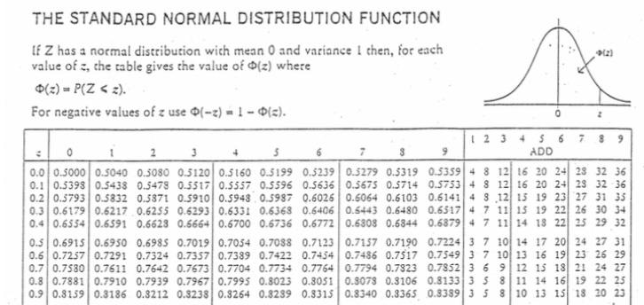
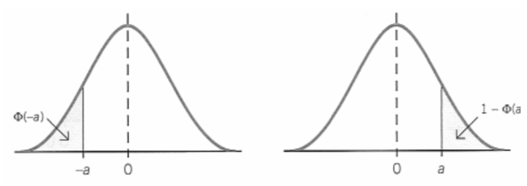
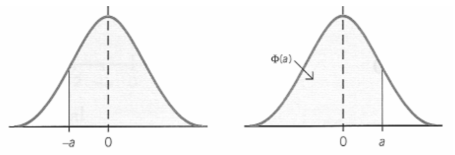
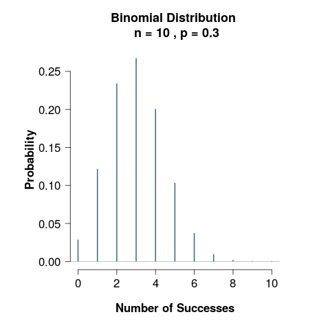
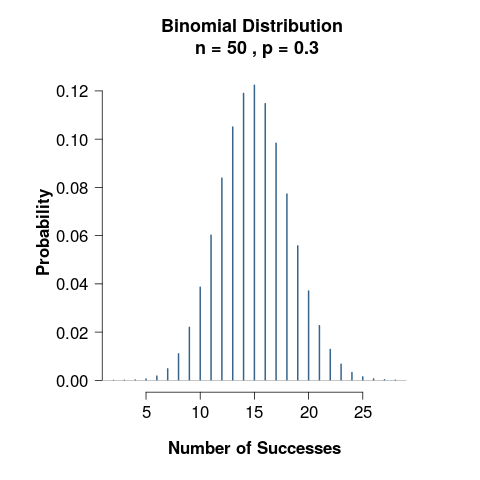
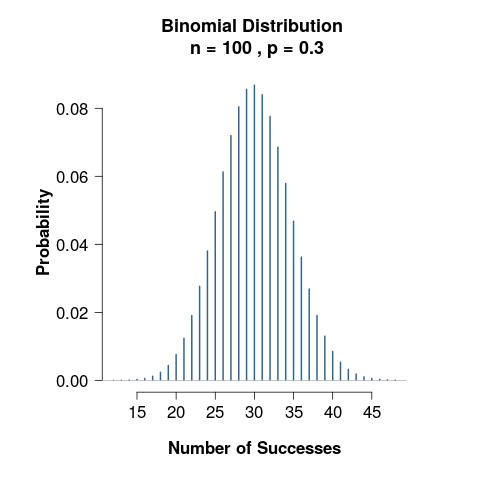
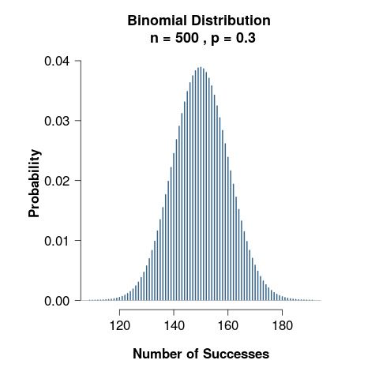
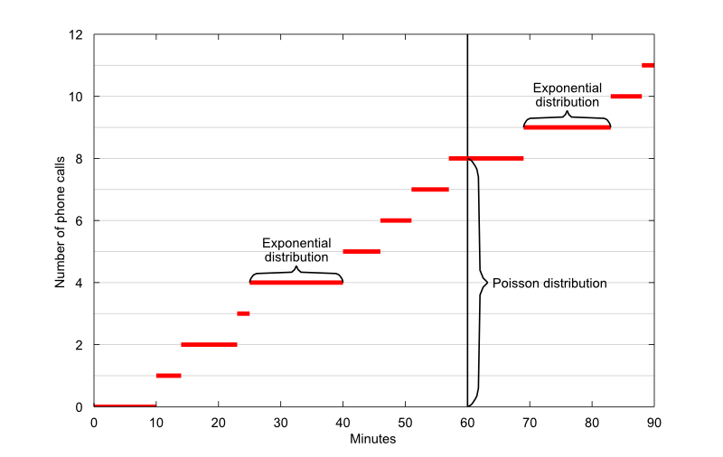
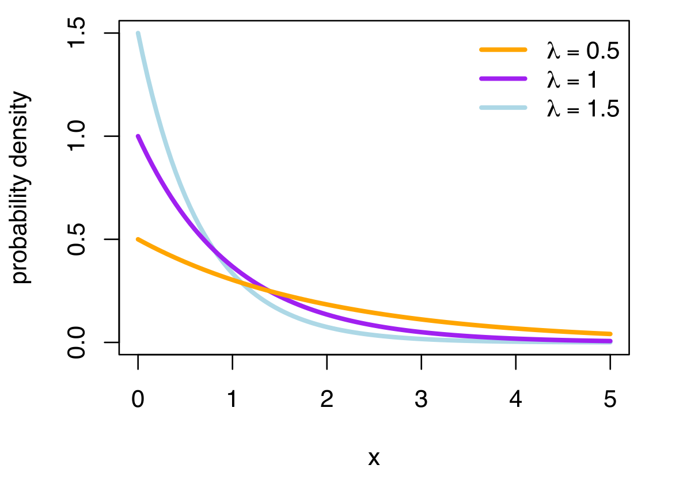

```{r setup, include=FALSE}
options(htmltools.dir.version = FALSE, width = 65)
knitr::opts_chunk$set(cache = TRUE)
library(tidyverse)
library(ptree)
```


layout: true

# Continuous Distribution

---

- This chapter concerns **continuous random variables**.

- When a variable is continuous, it can take on infinitely many, uncountable values, for example
  - The mass (grams) of a bag of sugar packaged by a particular machine.
  - The time taken (minutes) to perform a task.
  - The height (cm) of a three-year-old girl.
  - The lifetime (hours) of a 100-watt light bulb.
  

---

- A continuous random variable $X$ is described by its **probability density function** (pdf).

- It is specified for the range of values for which $x$ is valid (support).

- The pdf can be illustrated by a curve $y=f(x)$. Note that this function cannot be negative.

- Probabilities are given by the **area under the (pdf) curve**. It is sometimes possible to find an area by geometry (e.g. area of triangles, rectangles, etc.). However, often areas need to be calculated using integration.

---

_Example 5.1: $X$ is the delay in hours of a flight from Kuching, where_

$$f(x) = 0.2 - 0.02x,\hspace{1cm} 0\leq x \leq 10$$
_Find_

_(a) the probability that the delay will be less than four hours._

_(b) the probability that the delay will be between two and six hours._

--
  
.center[
```{r, echo = FALSE, fig.retina = 3, fig.height = 2, fig.width = 6, out.width = 1100, warning = FALSE}
x <- seq(0, 10, length = 100)
y <- 0.2 - 0.02 * x
dat <- data.frame(
  x = x,
  y = y
)
qplot(x, y, geom = "line", ylab = "f(x)") + theme_classic()
```
]

---
  
_(a) the probability that the delay will be less than four hours._

.center[
```{r, echo = FALSE, fig.retina = 3, fig.height = 2, fig.width = 6, out.width = 1100, warning = FALSE}
x <- seq(0, 10, length = 250)
y <- 0.2 - 0.02 * x
dat <- data.frame(
  x = x,
  y = y
)
ggplot(dat, aes(x, y)) +
  geom_line() +
  geom_segment(x = 4, xend = 4, y = 0, yend = 0.2 - 0.02 * 4, 
               linetype = "dashed") +
  geom_segment(x = 0, xend = 0, y = 0, yend = 0.2 - 0.02 * 0, 
               linetype = "dashed") +
  geom_ribbon(data = subset(dat, x <= 4), 
              aes(x = x, y = y, ymin = 0, ymax = y),
              alpha = 0.3) +
  annotate("text", x = 0.8, y = 0.22, label = "f(0) = 0.2") +
  annotate("text", x = 4.9, y = 0.14, label = "f(4) = 0.12") +
  labs(y = "f(x)") +
  theme_classic()
```
]

--

Area = $\frac{1}{2}(a+b)h=\frac{1}{2}(0.2 + 0.12)(4) = 0.64$

--

Alternatively, area = $\int_0^4 0.2 - 0.02x \, dx = [0.2x - 0.01x^2]_0^4 = 0.64$

--

$\therefore P(X\leq 4) = 0.64$

---

_(b) the probability that the delay will be between two and six hours._

.center[
```{r, echo = FALSE, fig.retina = 3, fig.height = 2, fig.width = 6, out.width = 1100, warning = FALSE}
x <- seq(0, 10, length = 250)
y <- 0.2 - 0.02 * x
dat <- data.frame(
  x = x,
  y = y
)
ggplot(dat, aes(x, y)) +
  geom_line() +
  geom_segment(x = 2, xend = 2, y = 0, yend = 0.2 - 0.02 * 2, 
               linetype = "dashed") +
  geom_segment(x = 6, xend = 6, y = 0, yend = 0.2 - 0.02 * 6, 
               linetype = "dashed") +
  geom_ribbon(data = subset(dat, x <= 6 & x >= 2), 
              aes(x = x, y = y, ymin = 0, ymax = y),
              alpha = 0.3) +
  annotate("text", x = 6.9, y = 0.1, label = "f(6) = 0.08") +
  annotate("text", x = 2.9, y = 0.18, label = "f(2) = 0.16") +
  labs(y = "f(x)") +
  theme_classic()
```
]

--

Area = $\frac{1}{2}(a+b)h=\frac{1}{2}(0.16 + 0.08)(4) = 0.48$

--

Alternatively, area = $\int_0^4 0.2 - 0.02x \, dx = [0.2x - 0.01x^2]_2^6 = 0.48$

--

$\therefore P(X\leq 4) = 0.48$

---

- It is not possible to find the probability that the delay is, say, **exactly** three hours.

- If you try to integrate, then

$$
\int_3^3 0.2 - 0.02x \, dx = [0.2x - 0.01x^2]_3^3 = 0
$$

- You can only find the probability that $X$ lies within a range.

- Also, for the same reason, it does not matter whether $\leq$ or $<$ was used. Therefore, these are all the same
  - $P(2 \leq X \leq 6)$
  - $P(2 < X \leq 6)$
  - $P(2 \leq X < 6)$
  - $P(2 < X < 6)$
  
---

For a continuous random variable $X$ with pdf $f(x)$ valid over the range $[a,b]$, 

$$\int_a^b f(x) \, dx = 1$$
.center[
```{r, echo = FALSE, fig.retina = 3, fig.height = 2.5, fig.width = 6, out.width = 1100, warning = FALSE}
x <- seq(-4, 4, length = 250)
y <- x^3 + 2 * x ^ 2 - 10 * x + 4
dat <- data.frame(
  x = x,
  y = y
)
ggplot(dat, aes(x, y)) +
  geom_line() +
  geom_segment(x = 2, xend = 2, y = 0, yend = 0.2 - 0.02 * 2, 
               linetype = "dashed") +
  geom_segment(x = 6, xend = 6, y = 0, yend = 0.2 - 0.02 * 6, 
               linetype = "dashed") +
  geom_ribbon(data = dat, 
              aes(x = x, y = y, ymin = -100, ymax = y),
              alpha = 0.3) +
  annotate("text", x = -4.2, y = -100, label = "a") +
  annotate("text", x = 4.2, y = -100, label = "b") +
  annotate("text", x = 0, y = -50, label = "Area = 1") +
  coord_cartesian(xlim = c(-6, 6)) +
  labs(y = "f(x)") +
  theme_classic() + 
  theme(axis.text.x = element_blank(), axis.text.y = element_blank(),
        axis.ticks.x = element_blank(), axis.ticks.y = element_blank())
```
]

---

_Example 5.2: A continuous random variable has pdf $f(x)=kx^2$ for $0<x<4$. Find $P(1\leq X \leq 3)$._

--

First, solve for $k$. Since the total area must equal 1,

$$
P(0\leq X \leq 4) = \int_0^4 kx^2 \, dx = \left[\frac{kx^3}{3} \right]_0^4 = 1
$$
$$
\Rightarrow k4^3/3 - 0 =1
$$
$$
\Rightarrow k = 3/64
$$

---
_Example 5.2: A continuous random variable has pdf $f(x)=kx^2$ for $0<x<4$. Find $P(1\leq X \leq 3)$._

Then, 
$$
P(1\leq X \leq 3) = \int_1^3 kx^2 \, dx = \left[\frac{kx^3}{3} \right]_1^3 = \frac{k}{3}(3^3 - 1) = 26k/3
$$
So $P(1\leq X \leq 3) = 3/64 \times 26/3 = 26/64 = 0.406$
---
layout: true

# Expectation

---

For a continuous random variable $X$ with pdf $f(x)$, the expected value of $X$ is given by the formula

$$
E(X) = \int_x xf(x) \, dx
$$

$E(X)$ is referred to as the _mean_ or _expectation_ of $X$ and is often denoted by $\mu$.

---

_Example 5.3: $X$ has pdf $f(x) = x^2/9$ for $0<x<3$. Find (a) $\mu$; and (b) $P(X<\mu)$._

--

(a) 

$$\begin{align}
\mu = \int_0^3 xf(x) \, dx &=  \int_0^3 x\cdot x^2/9 \, dx  \\
&= \frac{1}{9} \left[ x^4/4\right]_0^3 \\
&= 81/36 = 2.25
\end{align}$$

--

(b) $P(X<\mu) = P(X < 2.25) = \int_0^{2.25} x^2/9 \, dx = [x^3/27]_0^{2.25} = 0.42$

---

The expectation of **any function** of $X$ can also be derived<sup>1</sup> as

$$
E\big( g(X) \big) = \int_x g(x)f(x) \, dx
$$

For example,

- $E(X^2) = \int_x x^2f(x) \, dx$

- $E(1/X) = \int_x \frac{1}{x}f(x) \, dx$

- $E(e^{tx}) = \int_x e^{tx} f(x) \, dx$


.footnote[
----
[1] Assuming existence!
]

---

The properties of expectations also apply to continuous random variables: In general, for constants $a$, $b$ and $c$, and two random variables $X$ and $Y$,

- $E(a)=a$

- $E(aX)=aE(X)$

- $E(aX + bY + c) = aE(X) + bE(Y) + c$

Also, for two functions of $X$, $g(X)$ and $h(X)$,

- $E\big(g(X) + h(X) \big) = E\big(g(X)\big) + E\big(h(X)\big)$


---
layout:true

# Variance

---

As in the discrete case, the variance is given by

$$\text{Var}(X) = E\big((X-\mu)^2 \big)$$
and for continuous r.v. $X$ with pdf $f(x)$,

$$\begin{align}
\text{Var}(X) &= \int_x (x-\mu)^2 f(x) \, dx \\
&= \int_x x^2 f(x) \, dx - \mu^2\\
&= \int_x x^2 f(x) \, dx - E^2(X)\\
&= E(X^2) - E^2(X)
\end{align}$$

---

An as before, the following results also hold when $X$ is continuous ( $a$ and $b$ are constants)

- $\text{Var}(X) \geq 0$ 

- $\text{Var}(a) = 0$

- $\text{Var}(aX + b) = a^2 \text{Var}(X)$

Given another r.v. $Y$ such that $X$ and $Y$ are **independent**, and a constant $c$, then

- $\text{Var}(X+Y) = \text{Var}(X) + \text{Var}(Y)$

- $\text{Var}(aX\pm bY+c) = a^2\text{Var}(X) + b^2\text{Var}(Y)$
 
---

_Example 5.6: The continuous random variable $X$ has pdf $f(x)=x/8$, for $0<x<4$. Find the variance of $X$._

--

First find $E(X)$ and $E(X^2)$

$$\begin{align}
E(X) = \int_0^4 x\cdot \frac{x}{8} \, dx = \left[\frac{x^3}{24}  \right]_0^4 = 64/24 = 8/3
\end{align}$$

--

$$\begin{align}
E(X^2) = \int_0^4 x^2 \cdot \frac{x}{8} \, dx = \left[\frac{x^4}{32}  \right]_0^4 = 256/32 = 8
\end{align}$$

--

Thus, $\text{Var}(X) = E(X^2) - E^2(X) = 8 - (8/3)^2 = 8/9$

---
layout: true

# Cumulative distribution function

---

Recall that the cdf is defined as $F(x) = P(X\leq x)$.

For a continuous r.v. $X$ with pdf $f(x)$, the cdf is 

$$
F(x) = \int_{-\infty}^x f(\tilde x) \, d\tilde x
$$

.center[
```{r, echo = FALSE, fig.retina = 3, fig.height = 2.2, fig.width = 6, out.width = 1100, warning = FALSE}
x <- seq(-4, 4, length = 250)
y <- x^3 + 2 * x ^ 2 - 10 * x + 4
dat <- data.frame(
  x = x,
  y = y
)
ggplot(dat, aes(x, y)) +
  geom_line() +
  geom_segment(x = 4, xend = 4, y = -100, 
               yend = 4^3 + 2 * 4 ^ 2 - 10 * 4 + 4, 
               linetype = "dashed") +
  geom_ribbon(data = subset(dat, x < 2), 
              aes(x = x, y = y, ymin = -100, ymax = y),
              alpha = 0.3) +
  annotate("text", x = -4.2, y = -100, label = "a") +
  annotate("text", x = 4.2, y = -100, label = "b") +
  annotate("text", x = 2.1, y = -100, label = "x") +
  annotate("text", x = -0.8, y = -50, label = "Area = F(x)") +
  coord_cartesian(xlim = c(-6, 6)) +
  labs(y = "f(x)", x = "") +
  theme_classic() + 
  theme(axis.text.x = element_blank(), axis.text.y = element_blank(),
        axis.ticks.x = element_blank(), axis.ticks.y = element_blank())
```
]

---
  
_Example: $X$ has pdf $f(x)=x/8$, for $0<x<4$. Find $P(1<X<3)$ using the cdf._

--

First find the cdf

$$\begin{align}
F(x) = \int_{-\infty}^x \tilde x/8 \, d\tilde x 
&= \int_0^x \tilde x/8 \, d\tilde x \\
&= [\tilde x^2 / 16]_0^x \\
&= x^2/16
\end{align}$$

--

$$\begin{align}
P(1<X<3) &= F(3) - F(1)\\
&= 3^2/16 - 1/16 \\
&= 8/16 = 0.5
\end{align}$$

---
layout:false
class: center, middle, inverse

## Special continuous distributions: The normal distributions

---
layout:true

# The normal distribution

---

The normal distribution is the most important distribution in statistics.

- Many naturally occurring phenomena can be _modelled_ as following a normal distribution.

- The central limit theorem (CLT): The disribution of the mean of a sample tends to converge to a normal distribution, as more and more samples are collected.

- Often, the normal distribution is used for the error term in standard statistical models (e.g. linear regression).

---

Let $X$ be disributed according to a normal distribution with mean $\mu$ and variance $\sigma^2$. We write $X\sim\text{N}(\mu,\sigma^2)$. Then its pdf is

$$
f(x) = \frac{1}{\sigma\sqrt{2\pi}}\exp\left[-\frac{(x-\mu)^2}{2\sigma^2} \right]
$$

--

<u>Properties</u>

- The parameters of the normal distribution are the mean $E(X)=\mu$ and the variance $\text{Var}(X)=\sigma^2$.
- Support: $x\in\mathbb R$.
- The normal distribution is **symmetric** about $\mu$, and **centred** at $\mu$.
- Due to symmetry, median = mean = $\mu$.
- The mode is also $\mu$ (peaks at the mean).

---

.center[
```{r, echo = FALSE, fig.retina = 3, fig.height = 4, fig.width = 6, out.width = 1100, warning = FALSE}
x <- seq(-3.5, 3.5, length = 250)
y <- dnorm(x)
dat <- data.frame(
  x = x,
  y = y
)
ggplot(dat, aes(x, y)) +
  geom_line() +
  geom_segment(x = 0, xend = 0, y = 0.02, yend = dnorm(0), linetype = "dashed") +
  # geom_ribbon(data = subset(dat, x < 2), 
  #             aes(x = x, y = y, ymin = -100, ymax = y),
  #             alpha = 0.3) +
  annotate("text", x = 0, y = 0, label = expression(mu)) +
  # annotate("text", x = 4.2, y = -100, label = "b") +
  # annotate("text", x = 2.1, y = -100, label = "x") +
  # annotate("text", x = -0.8, y = -50, label = "Area = F(x)") +
  # coord_cartesian(xlim = c(-6, 6)) +
  labs(y = "f(x)", x = "") +
  theme_classic() + 
  theme(axis.text.x = element_blank(), axis.text.y = element_blank(),
        axis.ticks.x = element_blank(), axis.ticks.y = element_blank())
```
]

---

Effect of changing the mean (location). Variance $\sigma^2 = 1$.

.center[
```{r, echo = FALSE, fig.retina = 3, fig.height = 3.5, fig.width = 6, out.width = 1100, warning = FALSE}
x <- seq(-8, 6, length = 200)
y1 <- dnorm(x, mean = -4)
y2 <- dnorm(x, mean = 0)
y3 <- dnorm(x, mean = 2)
dat <- data.frame(x = x, y1, y2, y3)
colnames(dat) <- c("x", "mu = -4", "mu = 0", "mu = 2")
ggplot(reshape2::melt(dat, id = "x"), aes(x = x, y = value, col = variable)) +
  geom_line() +
  geom_segment(x = 0, xend = 0, y = 0, yend = dnorm(0), linetype = "dashed",
               col = iprior::gg_col_hue(3)[2]) +
  geom_segment(x = -4, xend = -4, y = 0, yend = dnorm(0), linetype = "dashed", 
               col = iprior::gg_col_hue(3)[1]) +  
  geom_segment(x = 2, xend = 2, y = 0, yend = dnorm(0), linetype = "dashed", 
               col = iprior::gg_col_hue(3)[3]) +    
  labs(y = "f(x)", x = "") +
  theme_classic() 
```
]

---

Effect of changing the variance (scale/spread). Mean $\mu = 0$.

.center[
```{r, echo = FALSE, fig.retina = 3, fig.height = 3.5, fig.width = 6, out.width = 1100, warning = FALSE}
x <- seq(-12, 12, length = 200)
y1 <- dnorm(x, sd = 1)
y2 <- dnorm(x, sd = 2)
y3 <- dnorm(x, sd = 4)
dat <- data.frame(x = x, y1, y2, y3)
colnames(dat) <- c("x", "var = 1", "var = 4", "var = 16")
ggplot(reshape2::melt(dat, id = "x"), aes(x = x, y = value, col = variable)) +
  geom_line() +
  labs(y = "f(x)", x = "") +
  theme_classic() 
```
]

---
layout: true

# The standard normal

---

The most important normal distribution is the special case when $\mu = 0$ and $\sigma^2 = 1$. This is called the **standard normal** distribution, denoted 

$$Z\sim \text{N}(0,1)$$

with pdf

$$
\phi(z) = \frac{1}{\sqrt{2\pi}}e^{-{z^2}/{2}}
$$

.footnote[
----
The pdf of $Z$ is denoted specially by the greek letter $\phi$, pronounced 'phi'.
]

---

Any normal r.v. can be **standardized** by 
- subtracting the mean
- dividing by the standard deviation

Let $X\sim\text{N}(\mu,\sigma^2)$. Then

$$
Z := \frac{X-\mu}{\sigma} \sim \text{N}(0,1) 
$$
---

Calculating probabilities of the (standard) normal distribution is not possible to do explicitly using integration. That is, 

$$
P(a\leq Z \leq b) = \int_a^b \phi(z) \, dz 
$$
is **not tractable** (no closed form exists).

Instead, we rely on **computer approximations**, or by manually searching for the values from a statistical table. Statistical tables will show values of the standard normal cdf

$$
\Phi(z) = P(Z \leq z) = \int_{-\infty}^z \phi(\tilde z) \, d\tilde z
$$
---

.center[]

--

Find (a) $P(Z < 0.85)$, (b) $P(Z>0.85)$

--

(a) $0.8023$, (b) $1-0.8023=0.1977$

---

Finding probabilities involving negative values of $z$.

$$ 
P(Z<-z) = \Phi(-z) = 1 - \Phi(z)
$$
.center[]

--

$$
P(Z>-z) = 1 - P(Z<-z) = 1 - (1-\Phi(z)) = \Phi(z)
$$
.center[]

---
  
_Example: Find $P(Z<-0.913)$ and $P(Z>-0.913)$._

.center[]

--

$P(Z<-0.913) = 1 - \Phi(0.913) = 1 - 0.8194 = 0.1806$.

---
  
_Example: Find $P(Z<-0.913)$ and $P(Z>-0.913)$._

.center[]

$P(Z>-0.913) = \Phi(0.913) = 0.8194$.

---

### Important results worth learning

- $P(Z\leq -a) = 1 - \Phi(a)$

- $P(Z\leq -a) = \Phi(a)$

- $P(a \leq Z \leq b) = \Phi(b) - \Phi(a)$

- $P(-a \leq Z \leq b) = \Phi(a) + \Phi(b) - 1$

- $P(-a \leq Z \leq -b) = \Phi(b) - \Phi(a)$

- $P(|Z| \leq a) = P(-a \leq Z \leq a) = 2\Phi(a) - 1$

- $P(|Z| \geq a) = P(\{Z < -a\} \cup \{Z >a\}) = 2\big(1-\Phi(a)\big)$

---

_Example 6.3: Lengths of metal strips produced by a machine are normally distributed with mean length of 150cm and a standard deviation of 10cm. Find the probability that the length of a randomly selected strip is_

_(a) shorter than 165cm._

_(b) within 5cm of the mean._

--

Let $X$ represent the lenghts of metal strips produced. Then $X\sim\text{N}(150, 10^2)$.

(a)

$$\begin{align}
P(X < 165) = P(Z < (165-150)/10) &= P(Z <1.5) \\
&= \Phi(1.5) = 0.9332 
\end{align}$$
---

(b) To be within 5cm of the mean implies that the value $X$ should not be more than 155cm and should not be less than 145cm. That is, $145 < X < 155$. 

--

Thus,

$$\begin{align}
P(145 < X < 155) &= P\left(\frac{145-150}{10} < Z <  \frac{155-150}{10} \right)\\
&= P(-0.5 < Z < 0.5)\\
&= 2\Phi(0.5) - 1 \\
&= 2\times 0.6915 -1 \\
&= 0.383
\end{align}$$

---
layout: true

# Linear functions of normal r.v.

---

If $X\sim \text{N}(\mu,\sigma^2)$ and $a$ and $b$ are constants (with $b\neq 0$), then:

$$
a + bX \sim \text{N}(a + b\mu, b^2\sigma^2)
$$

--

If $X_1$ and $X_2$ are _independent_ normal random variables, such that $X_1\sim\text{N}(\mu_1,\sigma_1^2)$ and $X_2\sim\text{N}(\mu_2,\sigma_2^2)$, then:

$$
X_1 \pm X_2 \sim\text{N}(\mu_1\pm\mu_2, \sigma_1^2 + \sigma_2^2)
$$

Note that variances are _added_ even when dealing with the difference between independent random variables.

---
  
_Example: An invester has the choice of two out of four investments: $X_1$, $X_2$, $X_3$ and $X_4$. The profits (in BND 1,000 per annum) from these may be assumed to be indpendently distributed and:_

- Profit from $X_1 \sim \text{N}(2,1)$
- Profit from $X_2 \sim \text{N}(3,3)$
- Profit from $X_3 \sim \text{N}(1,0.25)$
- Profit from $X_4 \sim \text{N}(2.5,4)$

_Which pair of investments should the investor choose in order to maximise the probability of making a total profit of at least BND 2,000? What is the maximum probability?_

--

Let's sum the ${}^4C_2=6$ possible pairwise combinations of normal r.v. Then calculate the $Z$ value. We want to maximise $P(Z>2)$ (the distribution which gives us the smallest $Z$ value).

---

- $X_1 + X_2 \sim \text{N}(5,4)$, $Z=-1.50$
- $X_1 + X_3 \sim \text{N}(3,1.25)$, $Z=-0.89$
- $X_1 + X_4 \sim \text{N}(4.5,5)$, $Z=-1.12$ 
- $X_2 + X_3 \sim \text{N}(4,3.25)$, $Z=-1.11$
- $X_2 + X_4 \sim \text{N}(5.5,7)$, $Z=-1.32$
- $X_3 + X_4 \sim \text{N}(3.5,4.25)$, $Z=-0.73$

--

Evidently, the combination of $X_1$ and $X_2$ gives us a mean profit of BND 5,000 with a standard deviation of 2. This gives the smalles $Z$ values and thus the highes probability of out all possible pairs of investments.

$$P(Z>-1.5) = \Phi(1.5) = 0.9332$$
---
layout:false

# 68-95-99.7 rule

Also known as the empirical rule, is a shorthand to remember the percentage of values that lie within a band around the mean in a normal distribution.

.center[]


---
layout:false
class: center, middle, inverse

## Normal approximations to discrete distributions


---
layout: true

## Normal approximation to binomial 

---

Recall that $X\sim\text{Bin}(n,p)$ has these properties 

- $P(X=x) = {n \choose x} p^x (1-p)^{n-x}$
- $E(X)=np$
- $Var(X)=np(1-p)$

--

Consider computing these probabilities below, when $n=100$:

- $P(X=50)$ (try calculating ${100 \choose 50}$ and $p^{50}$ for various values of $p$&mdash;what do you observe?)
- $P(X>50)$
- $P(25<X<75)$ (how many computations must you do?)
---

What does the distribution actually look like? Fix $p=0.3$ and let $n\to\infty$:

.center[]

---

What does the distribution actually look like? Fix $p=0.3$ and let $n\to\infty$:

.center[]

---

What does the distribution actually look like? Fix $p=0.3$ and let $n\to\infty$:

.center[]

---

What does the distribution actually look like? Fix $p=0.3$ and let $n\to\infty$:

.center[]

---

What does the distribution actually look like? Fix $p=0.3$ and let $n\to\infty$:

.center[]

---

.center[**When $np >5$ and $n(1-p)>5$, it is appropriate to use the normal approximation to the binomial**]

As $n\to\infty$, $\text{Bin}(n,p) \to N\big(np, np(1-p)\big)$. 
--
This means that for $X\sim \text{Bin}(n,p)$,

\begin{align*}
P(X < x) 
&\approx P\left(\frac{X-np}{\sqrt{np(1-p)}} < \frac{x-np}{\sqrt{np(1-p)}} \right) \\
&= \Phi\left( \frac{x-np}{\sqrt{np(1-p)}} \right)
\end{align*}

where $\Phi(\cdot)$ is the cdf of the standard normal distribution.
---
layout: true

# Continuity correction

---

For discrete distributions,
$$
P(X\leq x) = P(X < x+1)
$$
But we know for continuous distributions, $P(X\leq x) = P(X<x)$. 
So when a discrete $X$ is approximated by a continuous distribution, we must apply **continuity correction**.

--

Roughly speaking, 
$$
P(X \leq x) \approx P(X_{cts} < x + 1/2)
$$

---

Apply these continuity corrections in your calculations!

| Discrete | Continous |
|-------|:---:|
| $X=c$ | $c-0.5 < X < c + 0.5$ |
| $X<c$ | $X < c + 0.5$ |
| $X\leq c$ | $X < c + 0.5$ |
| $X>c$ | $X>c-0.5$ |
| $X\geq c$ | $X>c-0.5$ |

--

Questions
  - What is continuity correction for $a<X<b$?
  - What is $P(X>0)$?
  - What is $P(X=-1)$?

---
*Example 6.8: Find the probability of obtaining 4, 5, 6 or 7 heads when a fair coin is tossed 12 times.*

--

Let $X$ be the number of heads when coin is tossed 12 times.
$X\sim\text{Bin}(12,0.5)$. We are interested in $P(X=4,5,6,7)$.
Since $np$ and $n(1-p)$ are both greater than 5, we can use the normal approximation $X\sim N(6,3)$.

--

\begin{align*}
P(4 \leq X \leq 7) 
&\approx P(3.5 < X < 7.5) \\
&=P\left(\frac{3.5-6}{\sqrt{3}} < Z < \frac{7.5-6}{\sqrt{3}}  \right) \\
&=P(-1.44 < Z < 0.866) \\
&= \Phi(0.866) - \Phi(-1.44) \\
&= 0.8067549 - 0.0749337 = 0.732
\end{align*}

---
layout: true

## Normal approximation to Poisson 

---

Recall that $X\sim\text{Pois}(\lambda)$ has these properties 

- $P(X=x) = e^{-\lambda}\lambda^x/x!$
- $E(X)=\lambda$
- $Var(X)=\lambda$

--

For large $\lambda$ (say $\lambda=100$), try computing
- $e^{-\lambda}$
- $100^{100}$

--

This can be problematic if computations not handled carefully (just like the binomial case).

---

.center[**When $\lambda > 15$, it is appropriate to use the normal approximation to the Poisson**]

As $n\to\infty$, $\text{Pois}(\lambda)   \to N\big(\lambda, \lambda \big)$. 
--
This means that for $X\sim \text{Pois}(\lambda)$,

\begin{align*}
P(X < x) 
&\approx P\left(\frac{X-\lambda}{\sqrt{\lambda}} < \frac{x-\lambda}{\sqrt{\lambda}} \right) \\
&= \Phi\left(\frac{x-\lambda}{\sqrt{\lambda}} \right)
\end{align*}

where $\Phi(\cdot)$ is the cdf of the standard normal distribution.
But also don't forget *continuity correction*!

---

*Example 6.10: A radioactive disintegration gives counts that follow a Poisson distribution with a mean count of 25 per second. Find the probability that in a one-second interval the count is between 23 and 27 inclusive.*

--

Denote the radioactive disintegration counts by $X$. Then $X \sim \text{Pois}(25)$. We are interested in $P(23\leq X \leq 27)$. Since $\lambda>15$, we can apply a normal approximation.

--

\begin{align*}
P(23 \leq X \leq 27) 
&\approx P(22.5 < X < 27.5) \\
&=P\left(\frac{22.5-25}{\sqrt{25}} < Z < \frac{27.5-25}{\sqrt{25}}  \right) \\
&=P(-0.5 < Z < 0.5) \\
&= 2\Phi(0.5) - 1 \\
&= 2(0.6914625) - 1 = 0.383
\end{align*}


---
layout:false
class: center, middle, inverse

## Special continuous distributions: The exponential distributions


---
layout:true

# Exponential distribution
---

Suppose you are interested in

- The amount of time until an earthquake occurs.
- The time between two lightbulbs failing.
- The length (in minutes) of faculty staff meetings at UBD.
- The average waiting time at a hospital's A&E.

--

The exponential distribution is the probability distribution of the time between events in a Poisson point process, i.e., a process in which events occur continuously and independently at a constant average rate. 

---



---

Let $X$ be disributed according to an exponential distribution with rate $\lambda$. We write $X\sim\text{Exp}(\lambda)$. Then its pdf is

$$
f(x) = \lambda e^{-\lambda x}
$$

--

<u>Properties</u>

- The parameter of the exponential distribution is the rate $\lambda>0$.
- Support: $x>0$.
- $E(X) = 1/\lambda$.
- $Var(X) = 1/\lambda^2$.


---

The pdf experiences "exponential decay"&mdash; long  wait times between two events occuring becomes more and more unlikely.



---

*Example: Suppose $\lambda = 3$, find $P(0.5<X<1)$ and $P(X<6)$.*

--

\begin{align*}
P(0.5<X<1) &= \int_{0.5}^1 3e^{-3x}dx \\
&= [-e^{-3x}]_{0.5}^1 \\
&= e^{-1.5} - e^{-3}   = 0.173
\end{align*}


--


\begin{align*}
P(X<6) &= \int_{0}^6 3e^{-3x}dx \\
&= [-e^{-3x}]_{0}^6 \\
&= 1 - e^{-18}   \approx 1
\end{align*}

---
layout: true

# Memoryless property

---

The exponential distribution has what is called the "memoryless" property. 
Given that you know the last event occured in $x$ amount of time, the next occurence is independent of this.

--

\begin{align*}
P(X > s + t | X > s) = P(X > t)
\end{align*}

--

For example, assume that bus waiting times are exponentially distributed.
A memoryless wait for a bus would mean that the probability that a bus arrived in the next minute is the same whether you just got to the station or if you’ve been sitting there for twenty minutes already.

https://perplex.city/memorylessness-at-the-bus-stop-f2c97c59e420

---


layout: false
class: inverse, middle, center

# END

<!-- ```{r, include = FALSE} -->
<!-- system("decktape remark chapter4.html chapter4.pdf --chrome-arg=--disable-web-security") -->
<!-- ``` -->
