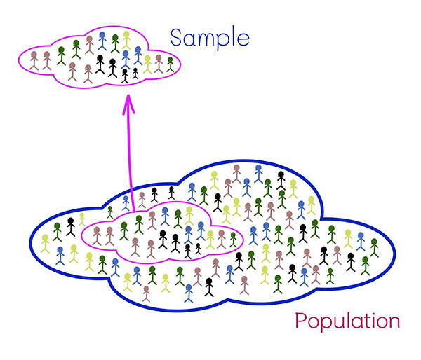

```{r setup, include=FALSE}
options(htmltools.dir.version = FALSE, width = 65)
knitr::opts_chunk$set(cache = TRUE)
library(tidyverse)
library(ptree)
```

---

# Population

In a statistical enquiry you often need information about a particular group. This group is known as the population or the target population, and it could be small, large or even infinite. Examples:

--

- Student body of UBD.
- Population of Brunei aged 15 to 60 in employment (Labour Force).
- Supermarkets in Brunei-Muara.
- Cans of soft drink produced in a factory.

--

  
Note: Populations don't always refer to groups of people, and population size may not be fixed or known.

---

# Sample


What if you wanted to know important aspects of the population, say

- What is the mean and standard deviation?
- What is the distribution like?
- How many are above a certain value $x$?
- What is the probability that...?

--

It seems that you will have to do data collection on every single unit in the population. Not always feasible!

--

In practice, we collect a random sample instead. It is **cheaper**, **saves time**, and it is possible to get **accurate results** if sampling is done correctly.

---

.center[]

---

# Statistic

Imagine having population values $X_1,\dots,X_N$, where each of these variates have mean $E(X_i)=\mu$ and variance $\text{Var}(X_i)=\sigma^2$.
From this entire population of size $N$, suppose you collect data represented by the random variables

$$\{X_1, X_2, \dots, X_n\}, \hspace{1em}n\ll N$$

--

A **statistic** is defined as a <u>known</u> function of these random variables. Therefore,

- $\bar X = \frac{1}{n}\sum_{i=1}^n X_i$

- $s^2 = \frac{1}{n-1}\sum_{i=1}^n (X_i - \bar X)^2$  

- $\max\{X_1, X_2, \dots, X_n\} - \min\{X_1, X_2, \dots, X_n\}$

are all examples of statistics.

---

## The sample mean

One of the most common statistic that we like to collect is the **sample mean**

$$\bar X = \frac{1}{n}\sum_{i=1}^n X_i$$

which is meant to give an **estimate** of the true population mean $\mu$.

--

Realise that the sample itself may be viewed as **random variables**, because undoubtedly there will be some random fluctuations in the data depending on who took the sample, when it was taken, how it was taken, etc.

--

This suggests that the sample mean (or any statistic) is random, and therefore has some kind of distribution!

---
layout: true

### The Central Limit Theorem (CLT)

---

A very important theorem in statistics concerning the sample mean is called the Central Limit Theorem (CLT). 

--

If $\{X_1, X_2, \dots, X_n\}$ is a random sample from a population with mean and variance $\mu$ and $\sigma^2$ respectively, then

$$
\bar X \sim \text{N}(\mu, \sigma^2/n)
$$

--

That is, the mean and variance of the <u>sample mean</u> are $E(\bar X) = \mu$ and $\text{Var}(\bar X)=\sigma^2/n$, and the sample mean is **normally distributed**.

---

Remarks:

- Amazingly, the samples themselves need not come from a normal distribution for CLT to work.

- This means that means of categorical data will also be subjected to CLT. For instance,

   - For binary variables (e.g. coin flip), then the proportion of 'Heads' will have a normal distribution by the CLT.

- The CLT depends on a large sample size $n$ to work. Typically $n\geq 30$ will do.


---


*Example: At a college the masses of the male students can be modeled by a normal distribution with mean mass 70kg and standard deviation 5kg.
Four male students are chosen at random. Find the probability that their mean mass is less than 65kg?*

--

Let $X_i$ represent the mass of a male student. Then $X_i\sim\text{N}(70,5^2)$. For these four students sampled, $\bar X_4\sim\text{N}(70,5^2/4)$ according to the CLT.

\begin{align*}
P(\bar X < 65) 
&= P\left(\frac{\bar X_4 - 70}{\sqrt{25/4}} < \frac{65 - 70}{\sqrt{25/4}}\right) \\
&= P(Z < -2) \\
&= 1 - \Phi(2)\\
&= 1 - 0.9772 = 0.0228.
\end{align*}

---

*Example 7.2: Thirty random observations are taken from each of the following distributions and the sample mean calculated. Find, in each case, the probability that the sample mean exceeds 5.*

*(a) X is the number of telephone calls made in an evening to a counseling service,
where X ~ Po(4.5).*

--

From the properties of a Poisson r.v., we know that $E(X)=\text{Var}(X)=\lambda=4.5$. So, the sample mean is distributed according to 
$\bar X \sim \text{N}(4.5,4.5/30)$.

\begin{align*}
P(\bar X>5) 
&= P\left( \frac{\bar X - 4.5}{\sqrt{4.5/30}} > \frac{5 - 4.5}{\sqrt{4.5/30}} \right) \\
&= P(Z>1.291) = 0.098
\end{align*}

---
layout: false

# Parameter estimation

Recall that, in order to specify a
- Binomial distribution, need $n$ and $p$

--

- Poisson distribution, need rate $\lambda$

--

- Normal distribution, need $\mu$ and $\sigma^2$

--

These are all called the **parameters** of the distribution. We need them to calculate the mean and variance of a distribution, for example.

--

Suppose you don't know the values of these parameters. How can you estimate the mean and variance? We can obtain an estimate by looking at the data collected, and using the appropriate statistic.

---
## Point estimates (mean)


---

layout: false
class: inverse, middle, center

# END

<!-- ```{r, include = FALSE} -->
<!-- system("decktape remark chapter4.html chapter4.pdf --chrome-arg=--disable-web-security") -->
<!-- ``` -->
